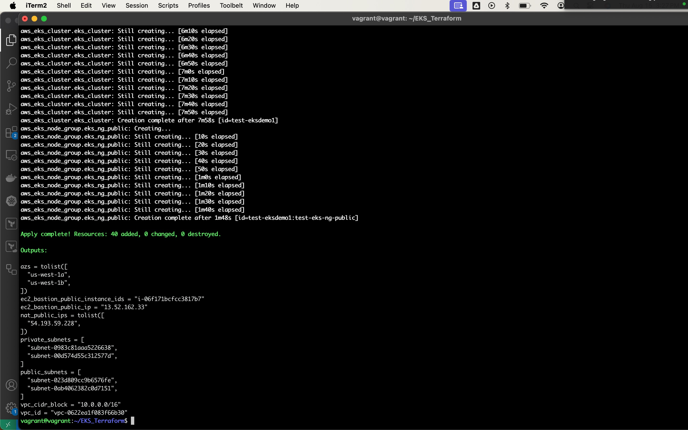
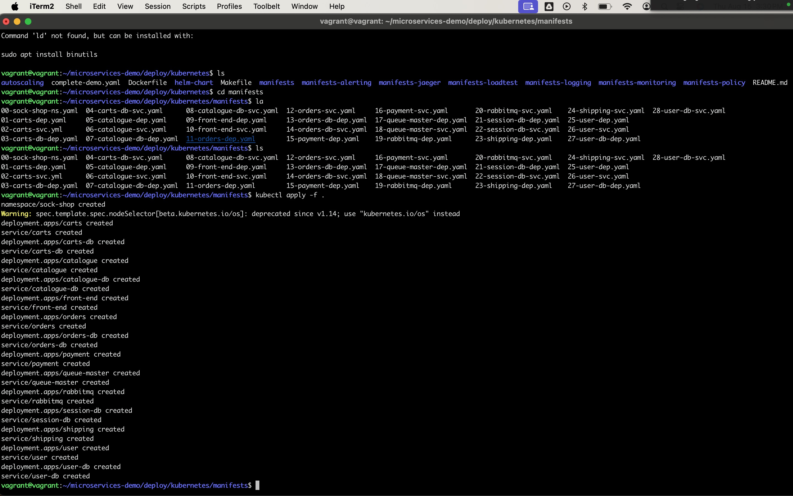

# Deploying the Socks Shop microservices application using Infrastructure as Code (IaC) on Kubernetes

### Setup Details

Application Repo: [microservice-demo](https://github.com/microservices-demo/microservices-demo/tree/master)

Cloud Provider: AWS

Deployment pipeline: Jenkins

Monitoring: Grafana

Metrics: Alertmanager

Logging: Prometheus

Tools: AWS CLI, Kubectl, Helm and Terraform

---

## Deploment Steps

### Phase 1: Environment Setup

- Setup cloud resources such as EC2 Instance, VPC, Elastic IP and Bastion Instance and Kubernetes Cluster

- Update kubeconfig

`aws eks --region us-west-1 update-kubeconfig --name test-eksdemo1`

### Phase 2: Deployment

- Deploy using the manifest file

- Get services and pods deployment status

.jpeg>)

- Install Helm and Setup ingress

    `curl https://raw.githubusercontent.com/helm/helm/main/scripts/get-helm-3 | bash`

    `helm version`

    - Choose the version nginx controller that is compatible with your k8s

        `helm repo add ingress-nginx https://kubernetes.github.io/ingress-nginx`
        `helm search repo ingress-nginx --versions
`
    - Install ingress-nginx controller

        `mkdir ./manifest`

    - helm template ingress-nginx ingress-nginx \
        --repo https://kubernetes.github.io/ingress-nginx \
        --version ${CHART_VERSION} \
        --namespace ingress-nginx \
        > ./manifest/nginx-ingress.${APP_VERSION}.yaml

    - kubectl create namespace ingress-nginx

    - deploy the file in ./manifest

        `kubectl apply -f ./manifest`

    - Confirm the port
    `kubectl get svc -n ingress-nginx`

        `kubectl -n ingress-nginx port-forward svc/ingress-nginx-controller 80`

    - Create a domain and let it point to the load balancer that ingress has created

    

    - Install cert-manager
    
    `kubectl apply -f https://github.com/cert-manager/cert-manager/releases/download/v1.13.0/cert-manager.yaml`

    - Create cluster issuer

        `kubectl apply -f cluster-issuer.yaml`

    - Create the ingress

        `kubectl get ingress`

    - See the certs and secrets

        `kubectl get certs`

        `kubectl get secrets`

    

